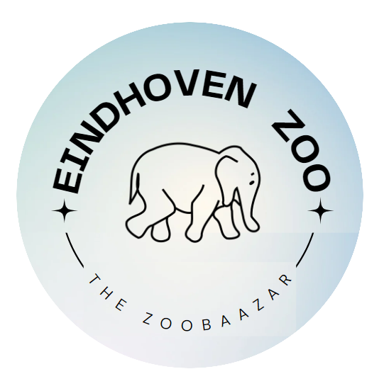
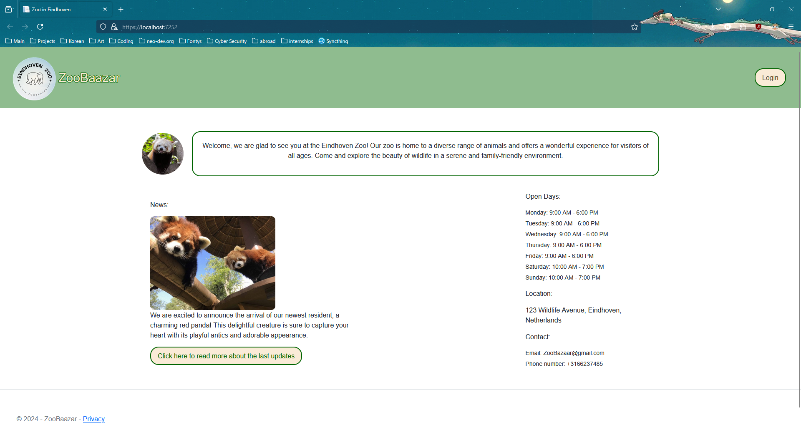
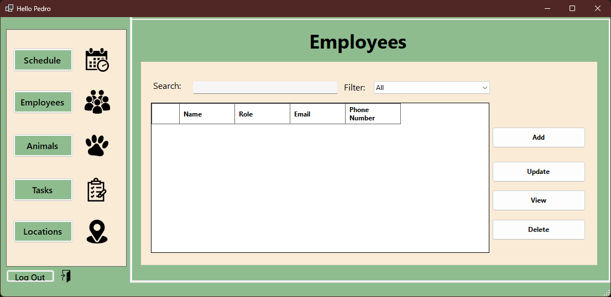
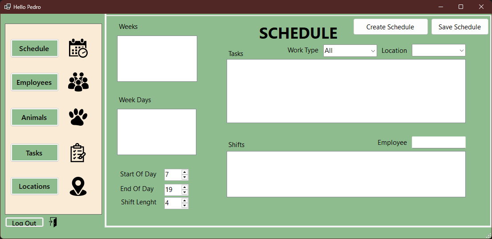

<h1 align="center">
   
    </a>
   
  ZooBaazar
   
</h1>

<h4 align="center">The group project counterpart to <a href="https://github.com/N4fta/RSS-Hamster" target="_blank">RSS Hamster</a>, build with WinForms for a desktop application and ASP.NET Razor Pages for a web interface.</h4>

<!-- Horizontal short Menu (w\ Links) -->

  <a href="#key-features">Key Features</a> •
  <a href="#gallery">Gallery</a> •
  <a href="#retrospective">Retrospective</a> •
  <a href="#credits">Credits</a>

## Key Features

- Website for clients and employees
- Desktop application for admins
- Animal tracker
- Task tracker
- Location manager
- Automatic scheduling & assignment to employees

## Gallery

## Retrospective

This semester was more focused on the using the correct process, Agile methodologies, OOP and other important concepts. While the project looks as or less impressive than the previous one, the code is miles ahead. Although it is still quite spaghetti at times.

I learned a lot of concepts and patterns that I uses in the next project midway when it was too late to implement them, as well as more grueling stuff like dealing with client requirements and long term planning.

This was also my first time using databases, segmenting my project into libraries and hosting websites and databases. My first, "real", medium scale, professional project. Overall, a very educational project.

## Credits

This software uses:

- [WinForms](https://learn.microsoft.com/en-us/dotnet/desktop/winforms/?view=netdesktop-9.0)
- [Razor Pages](https://learn.microsoft.com/en-us/aspnet/core/razor-pages/?view=aspnetcore-9.0)
- [MSSQL](https://www.microsoft.com/en-us/sql-server/sql-server-downloads)
- [Filezilla](https://filezilla-project.org/)

Created with the help of some Fontys students at [Fontys](https://www.fontys.nl/).

Developed Spring 2024

### My Links

> [neo-dev.org](https://neo-dev.org) &nbsp;&middot;&nbsp;
> GitHub [@N4fta](https://github.com/N4fta)
